# Global Disaster Response Prediction

## 0. Demonstration


<div style="text-align: center;">
 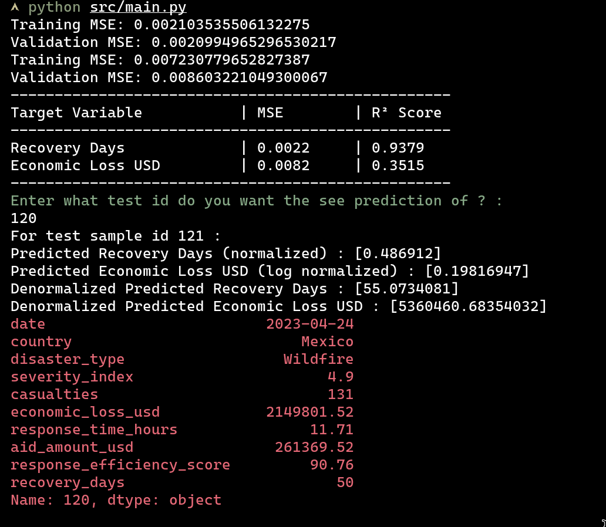
</div>


## 1. General information

**Name of the project:** Global Disaster Response Prediction

**Type of the project:** Personal

**Main Language(s) of the project:** Python

**Goal of this project:**
The goal was to build a model capable of predicting the number of days required for recovery and the estimated economic loss in USD following a disaster. I wanted to see how well linear models could handle this data based on metrics like severity index, casualties, and response time. This project was primarily a warm-up exercise to get familiar with machine learning workflows again after spending some time doing low-level programming.

**Scope of this project:**
This is a small-scale regression analysis project. It processes a specific dataset, trains linear models, and outputs predictions. It does not involve complex deployment or deep learning architectures.

**Why:** I wanted to get my hands on machine learning again and I found this data set in kaggle that I thought was interesting.

**Compatibility:**
ALL OS are supported since python is platform independant.

This project requires Python 3 (specifically tested on 3.13). It relies on standard data science libraries: `pandas`, `numpy`, and `scikit-learn`.

## 2. Project

**What stuff the project tries to implement:**
The project implements a full data pipeline including loading raw data, feature engineering, normalization, model training, and evaluation. It predicts two distinct target variables: `recovery_days` and `economic_loss_usd`.

**How did the project implement them:**
I started by splitting the data into training, validation, and testing sets. For feature engineering, I extracted year, month, and day from the date stamps and applied one-hot encoding to categorical features like country and disaster type. I normalized numerical inputs using Min-Max scaling.

For the target variables, I applied specific preprocessing. I used Min-Max scaling for recovery days and a log transformation combined with scaling for the economic loss to handle the massive variance in financial numbers.

I trained two separate Linear Regression models. Regarding performance, I found the economic loss model had an R² score of around 0.3. While the predictions were often off by millions in absolute terms, the model generally got the order of magnitude correct.

## 3. How to run the project :

You need to have the required packages installed (`pandas`, `numpy`, `scikit-learn`).

You can install them using `pip install requirements.txt` but I dont recommend it since I have been
expermenting a lot and the requirements.txt is basically bloated.

Navigate to the `code` directory in your terminal. Run the main script:

```bash
python src/main.py
```

The script will train the models and print the Mean Squared Error and R² scores. It will then prompt you to enter a test ID (an integer) to see a specific prediction compared to the actual data.

## 4. Data Visualizations

I generated several plots during the analysis phase to understand the feature distributions and their relationship with the target variables.

**Distributions and Correlations**
I checked the distribution of features and targets in the training set and analyzed the correlation matrix.

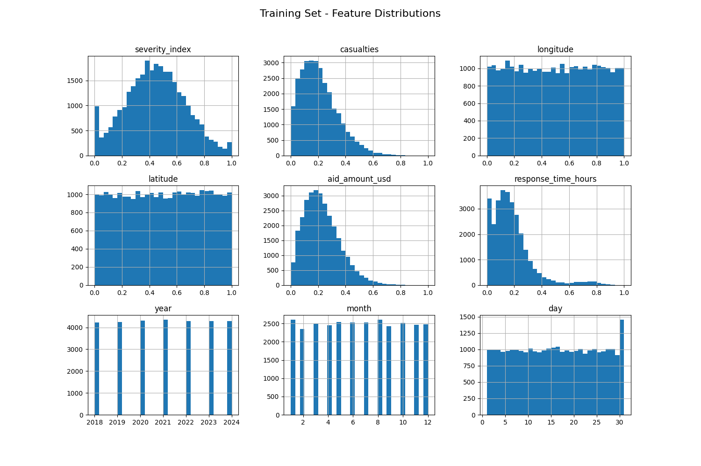
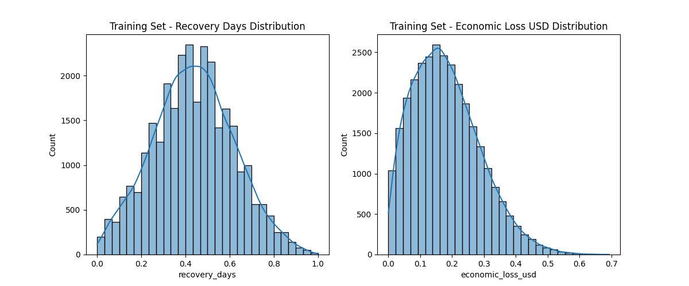
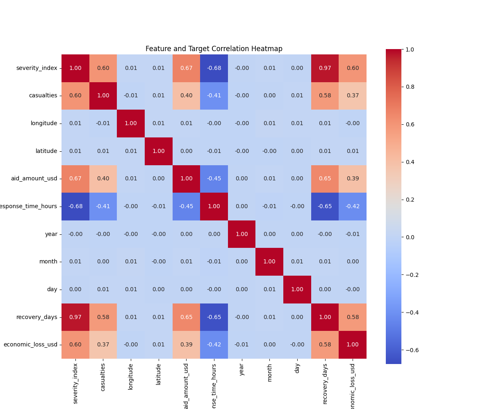

**Feature Analysis**
I plotted specific features like severity, casualties, and response time against the targets to identify potential linear relationships.

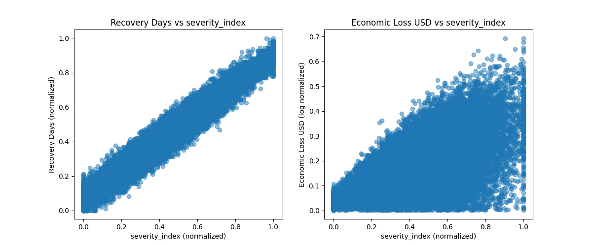
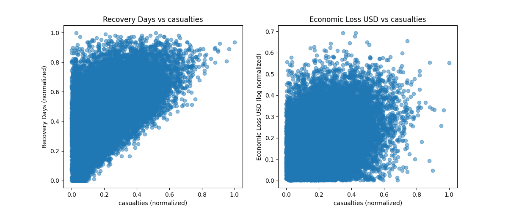
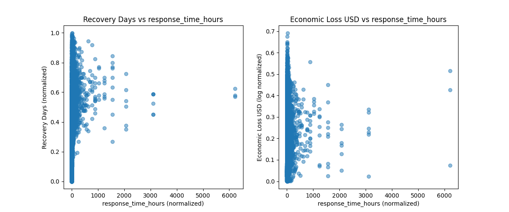
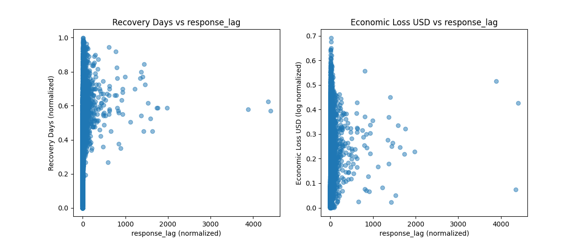

**Financial Data Analysis**
Since the economic data and aid amounts varied heavily, I plotted them on both standard and log scales.

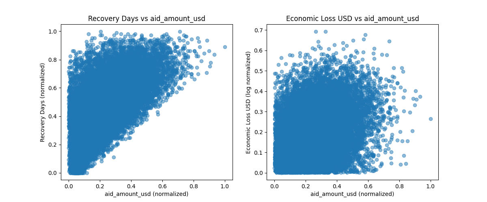
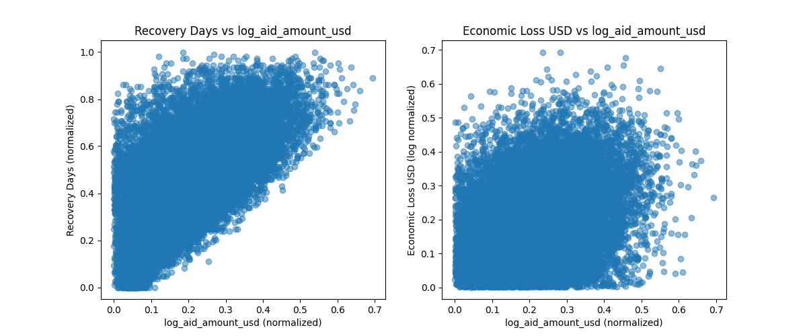
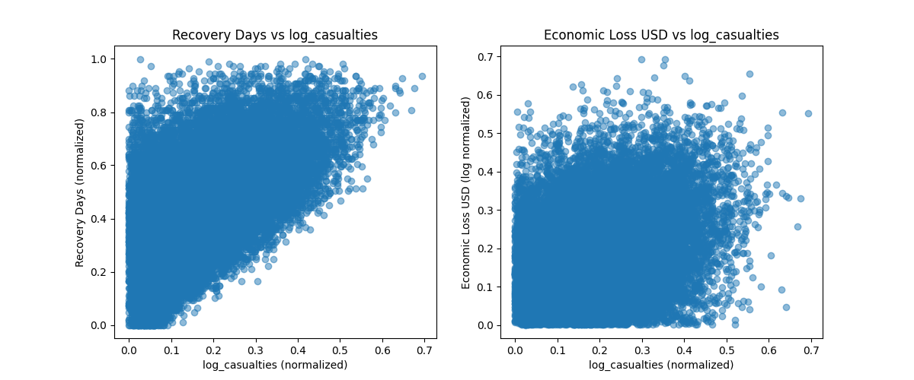
